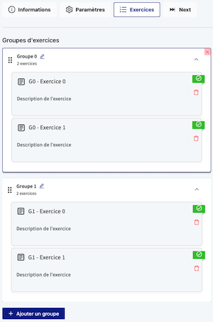
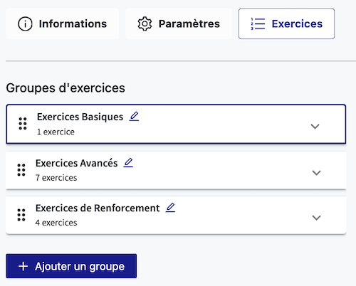

import { Callout } from 'nextra/components'

# Programmation du Next

<Callout type="info">Ce guide s’applique au langage **Python**.
Si vous utilisez un autre langage, le principe reste le même,
mais les fonctions spécifiques à la librairie NextLib ne seront pas disponibles.</Callout>

## Fonctionnement général

Le fichier next.py est un script Python permettant de gérer l'ordre d'enchainement des exercices dans une activité.
Il fonctionne de manière **stateless**, c'est-à-dire qu'il ne conserve aucun état entre deux exécutions.
Chaque fois qu’un étudiant termine un exercice, le script est entièrement réexécuté pour déterminer le prochain exercice à lancer.

Pour facilité la programmation du Next, une **librairie de fonctions** est disponible, appelée NextLib.
Cette librairie contient des fonctions permettant de récupérer des informations sur les exercices, de lancer des exercices, de gérer la notation de l'activité, etc.

<Callout type="info">Les fonctions présentées dans ce guide sont des exemples.
Une documentation complète des fonctions disponibles dans la NextLib est disponible ici : [Documentation NextLib](/main/programing/activity/next-navigation/nextlib).</Callout>

## Exemple basique

Voici un exemple simple d’un script next.py qui lance chaque exercice une fois, dans un ordre aléatoire :

```python
# Si tous les exercices ont été faits au moins une fois,
# on calcule la note de l'activité et on arrête l'activité
if isAllExercisesPlayed():
    setActivityGrade(average_grade_strategy)
    stopActivity()

# Empêche de passer à l'exercice suivant si le dernier lancé n'a pas été essayé
playPreviousIfUnplayed()

# Lance un exercice aléatoire qui n'a pas encore été fait
playExercise(getRandomUnplayedExerciseId())
```

Dans cet exemple, plusieurs points importants sont à noter :

1. **Interruption de l'exécution :** Quand une fonction du type `play...()` lance un exercice, cela interrompt l'exécution du script Next. La suite du script ne sera donc pas exécutée.
2. **Réexécution complète :** Le script est réexécuté entièrement à chaque fois qu'un exercice est terminé. Il est donc essentiel de vérifier en début d’exécution si tous les exercices ont été faits pour arrêter l’activité sans en relancer un autre.
3. **Faire l'exercice en cours :** La fonction `playPreviousIfUnplayed()` est utilisée pour éviter de lancer un nouvel exercice si l'étudiant n'a pas encore essayé l'exercice en cours.
4. **Lancement des exercices non faits :** Les fonctions appelées ne lancent que des exercices "unplayed", c'est-à-dire qui n'ont pas encore été faits par l'étudiant. Cela permet de s'assurer que l'on ne relance pas à l'infini le même exercice.
5. **Fin du script :** Si on arrive à la fin du script sans avoir effectué d'action (lancer un exercice, stopper l'activité, etc.), une erreur sera levée. Il est donc important de toujours s'assurer que le script a bien une action à effectuer.
6. **Session de l'étudiant :** Si l'étudiant ferme son navigateur ou se déconnecte, sa session est conservée. Il pourra reprendre l'activité là où il l'a laissée lors de sa prochaine connexion.

Cet exemple est très basique, mais il est possible de programmer des Next beaucoup plus complexes en utilisant des conditions et des stratégies de notation personnalisées.
Ce guide explique en détail comment programmer un Next complet et intelligent.

## Lancer des exercices

Pour programmer un Next, la première étape est de pouvoir lancer des exercices.
Pour cela, plusieurs fonctions sont disponibles dans la NextLib.

### Obtenir l'identifiant d'un exercice

```python
getExerciseId(groupNb: int = 0, exerciseNb: int = 0) -> str
```

Cette fonction permet de récupérer l’identifiant unique d’un exercice en spécifiant son numéro de groupe et sa position dans ce groupe.
L’ordre des exercices est déterminé par leur **ordre d’ajout dans l’activité** :



### Lancer un exercice

```python
playExercise(exerciseId: str, params: Optional[dict] = None) -> None
```

Cette fonction permet de démarrer un exercice à partir de son identifiant. **Une fois appelée, elle interrompt immédiatement l’exécution du script Next**, le reste du code ne sera donc pas exécuté.

Le paramètre optionnel `params` permet de transmettre des données supplémentaires à l'exercice. Son utilisation est expliquée en détail [ici](#paramétrage-dexercices).

<Callout type="info">D'autres fonctions sont disponibles pour lancer des exercices, comme `playPreviousIfUnplayed()` ou `playAllFromGroup(groupNb: int, randomOrder: bool = False)`.
Les détails sont disponibles dans la [documentation de la NextLib](/main/programing/activity/next-navigation/nextlib).</Callout>

### Stopper l'activité

Pour finir l'activité et afficher le récapitulatif des notes, il est possible d'utiliser la fonction suivante :

```python
stopActivity() -> None
```

### Exemples d'utilisation

```python
# Récupère l'id de l'exercice 1 du groupe 0
exerciseId = getExerciseId(0, 1)

# Lance l'exercice
playIfUnplayed(exerciseId)

# Lance l'exercice 5 du groupe 2
playIfUnplayed(getExerciseId(2, 5))

# Fin de l'activité
stopActivity()
```

```python
# Lance tous les exercices du groupe 1 dans un ordre aléatoire
playAllFromGroup(1, True)

# Lance un exercice aléatoire du groupe 2
playAnyFromGroup(2)

# Fin de l'activité
stopActivity()
```

## Programmer un Next intelligent

Pour programmer un Next intelligent, il est possible d'utiliser des conditions pour déterminer le prochain exercice à lancer.

### Fonctions de récupération de données

Pour récupérer des données sur les exercices, plusieurs fonctions sont disponibles, par exemple :

```python
# Teste si un exercice a été fait
isPlayed(exerciseId: str) -> bool

# Récupère la note du dernier exercice
getPreviousGrade() -> Optional[int]

# Récupère la dernière note d'un exercice
getExerciseLastGrade(exerciseId: str) -> Optional[int]

# Récupère la meilleure note d'un exercice
getExerciseBestGrade(exerciseId: str) -> Optional[int]

# Récupère le nombre de tentatives d'un exercice
getExerciseAttempts(exerciseId: str) -> int

# Récupère l'identifiant du dernier exercice lancé ou None s'il n'y en a pas
getPreviousExerciseId() -> Optional[str]

...
```

### Exemples d'utilisation

Ces fonctions peuvent être utilisées pour ajouter une logique d'enchainement plus complexe, par exemple :

1. Relancer un exercice si la note est inférieure à 50 :

```python
previousId = getPreviousExerciseId()  # Récupère le dernier exercice lancé
if previousId and getPreviousGrade() < 50:
    playExercise(previousId)
else:
    playFirstUnplayedExercise()
```

2. Lancer un exercice avancé si la note est supérieure à 80 :

```python
previousId = getPreviousExerciseId()
if not previousId:
    playExercise(getExerciseId(0, 0))  # Démarre par le premier exercice
elif getPreviousGrade() >= 80:
    playExercise(getExerciseId(1, 0))  # Exercice avancé
else:
    playExercise(getExerciseId(2, 0))  # Exercice de renforcement
```

Dans cet exemple, l'activité est organisée en trois groupes d'exercices, comme suit :



3. Relancer un exercice si la meilleure note est inférieure à 70 et qu'il y a moins de 3 tentatives :

```python
previousId = getPreviousExerciseId()
# Si aucun exercice n'a été lancé, on lance le premier exercice non fait
if not previousId:
    playExercise(playFirstUnplayedExercise())

bestGrade = getExerciseBestGrade(previousId)
attempts = getExerciseAttempts(previousId)

# bestGrade peut être None si l'exercice n'a pas encore été fait
if bestGrade is not None and bestGrade < 70 and attempts < 3:
    playExercise(previousId)
else:
    playFirstUnplayedExercise()
```

## Gestion de la notation

Pour gérer la notation de l'activité, il faut utiliser la fonction suivante :

```python
setActivityGrade(grade_aggregation_strategy: Callable[[], int]) -> None
```

Cette fonction permet de calculer la note finale de l'activité en fonction de la stratégie de notation passée en paramètre.
La stratégie de notation est une fonction qui ne prends pas de paramètre et qui retourne un entier, correspondant à la note finale de l'activité.
Par défaut, la NextLib propose deux stratégies de notation :
- `average_grade_strategy` : Moyenne des notes de tous les exercices
- `best_grade_strategy` : Note maximale obtenue

<Callout type="info">Il est possible de définir sa propre stratégie de notation en passant une fonction personnalisée.</Callout>

### Exemples d'utilisation

1. Prendre la meilleure note obtenue :

```python
if isAllExercisesPlayed():
    setActivityGrade(best_grade_strategy)
    stopActivity()  # On stoppe l'activité après avoir défini la note

playPreviousIfUnplayed()

playFirstUnplayedExercise()
```

2. (Stratégie personnalisée) Enlever des points en fonction du nombre de tentatives :

```python
def attempts_strategy():
    nbAttempts = 0
    for g in range(0, getGroupsCount()):
        for e in range(0, getGroupExercisesCount(g)):
            nbAttempts += getExerciseAttempts(getExerciseId(g, e))
    # Note = Moyenne des notes - Nombre de tentatives
    return max(0, average_grade_strategy() - nbAttempts)

setActivityGrade(attempts_strategy)
stopActivity()
```

<Callout type="info">Les statégies sont des fonctions, elles peuvent donc être appelées n'importe.</Callout>

## Mémoire du Next

Pour stocker des informations entre les différentes exécutions du Next, il est possible d'utiliser les fonctions suivantes :

```python
# Stocke une valeur
save(variableName: str, value: Any) -> None

# Récupère une valeur
load(variableName: str, default: Any = None) -> Optional[Any]
```

<Callout type="info">Il est possible de stocker des données de tout type sérialisables en JSON, comme des nombres, des chaînes de caractères, des listes, des dictionnaires, etc.
Cependant, cela ne fonctionne pas avec des classes personnalisées.</Callout>

### Exemple d'utilisation

Lance les exercices à faire dans l'ordre défini dans la liste `exercisesToDo` :

```python
# Charge la liste des exercices à faire ou initialise une liste par défaut
exercisesToDo = load("exercisesToDo", [0, 3, 5, 7])

# Vérifie que la liste n'est pas vide
if exercisesToDo:
    # Recupère le premier exercice de la liste et le retire
    todo = exercisesToDo.pop(0)
    # Sauvegarde la liste des exercices restants pour la prochaine exécution
    save("exercisesToDo", exercisesToDo)
    # Lance l'exercice
    playExercise(getExerciseId(0, todo))
else:
    stopActivity()
```

## Paramétrage d'exercices

Il est possible de transmettre des paramètres à un exercice lors de son lancement.
Pour cela, il suffit de passer un dictionnaire de paramètres en deuxième argument de la fonction `playExercise(exerciseId, params)`.

Les paramètres correspondent à des variables qui seront accessibles dans l'exercice.
Cela impacte l'exercice de la même manière qu'avec l'utilisation des [main.plc / main.plo](/main/programing/exercise/config).
Cependant, ici les paramètres sont passés via le Next, ce qui permet de les générer dynamiquement en Python en fonction de la logique du Next.

<Callout type="warning">Tout comme pour les plc/plo, les variables passées en paramètre **écrasent les variables de l'exercice** si elles ont le même nom.
Un exercice adapté à la réception de paramètres doit donc être prévu pour éviter des comportements inattendus.</Callout>

### Exemples d'utilisation

```python
# Surcharge le titre de l'exercice
playExercise(getExerciseId(0, 0), {"title": "Exercice paramétré"})

# Passe un paramètre de difficulté
playExercise(getExerciseId(0, 1), {"difficulty": 3})

# Passe plusieurs paramètres
playExercise(getExerciseId(0, 2), {"title": "Exercice 3",
                                   "result": 42,
                                   "previousGrade": getPreviousGrade()})
```

## Accès aux variables d'exercices

Il est possible d'accéder aux variables d'un exercice pour récupérer des informations.
Pour cela, il faut utiliser la fonction `getExerciseVariable(exerciseId, variableName)`.

<Callout type="warning">L'accès aux variables des exercices doit être activé dans l'onglet `Next` de l'activité pour pouvoir utiliser ces fonctions. ([Configuration](/main/programing/activity/next-navigation/next#configuration))</Callout>

### Exemple d'utilisation

Utiliser la réponse à un exercice précédent pour un exercice suivant :

```python
# Lance l'exercice 1
ex1Id = getExerciseId(0, 1)
playIfUnplayed(ex1Id)

# Récupère la valeur de la variable "form" de l'exercice 1
ex1Form = getExerciseVariable(ex1Id, "form")

# Lance l'exercice 2 en passant la réponse de l'exercice 1
ex2Id = getExerciseId(0, 2)
playIfUnplayed(ex2Id, {"previousAnswer": ex1Form})

# Fin de l'activité
setActivityGrade(average_grade_strategy)
stopActivity()
```

## Génération d'exercices

Il est possible de générer des exercices de manière dynamique durant l'exécution du Next.
Pour cela, il faut utiliser la fonction `generateAndPlayExercise(exerciseId, params)`.
Cette fonction génère un nouvel exercice à partir d'un exercice donné, modifié par les paramètres passés, et le lance.
Cela permet de créer une infinité d'exercices différents dans la même activité.

Cette fonction possède 3 comportements possibles :
1. Si l'exercice n'a pas été généré, il est généré et lancé. *(Et l'exécution du Next est interrompue)*
2. Si l'exercice a été généré à l'itération précédente, la fonction renvoie l'id de l'exercice généré.
3. Sinon, la fonction renvoie `None`.

<Callout type="info">Un exercice est considéré comme déjà généré si le couple (exerciceId, paramètres) a déjà été utilisé.</Callout>

<Callout type="info">**Astuce** : Il est possible de générer plusieurs fois le même exercice avec les même paramètres en ajoutant un identifiant unique dans les paramètres.</Callout>

### Exemple d'utilisation

L'exemple suivant génère un exercice à chacune des 3 itérations, avec un énoncé différent.
Il stocke la note de chaque exercice généré.
Puis lance l'exercice 1 d'origine.

```python
ex1 = getExerciseId(0, 0)
for i in range(3):
    exId = generateAndPlayExercise(ex1, {"statement": "Exercice avec i = " + str(i)})
    if exId:
        # Ici, on peut utiliser l'id du dernier exercice généré pour,
        # par exemple, récupérer des informations
        save("grade" + str(i), getExerciseLastGrade(exId))

playIfUnplayed(ex1, {"statement": "Le vrai ex1"})

stopActivity()
```

## Débogage du Next

Pour faciliter le débogage du Next, il est possible d'utiliser la fonction `platon_log(*args: Any)`.
Cette fonction affiche un message dans la console de débogage de l'exercice lancé.
Le fonctionnement est le même que [pour les exercices](/main/programing/exercise/logger).

### Exemple d'utilisation

```python
platon_log("Début du script Next")

platon_log("Note actuelle :", getPreviousGrade(), "/ 100")
```

Dans la console de débogage :

```
Début du script Next
Note actuelle : 42 / 100
```
