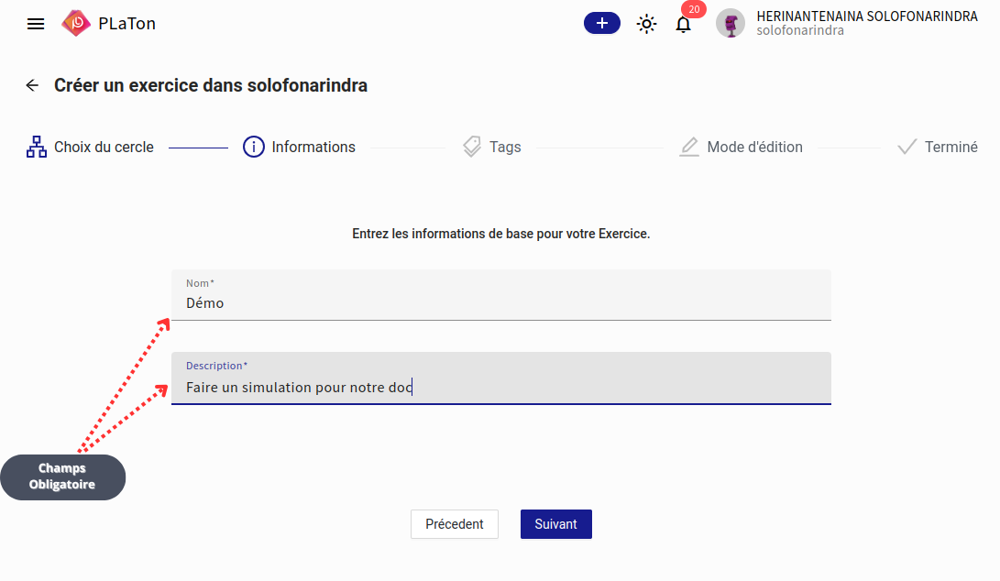
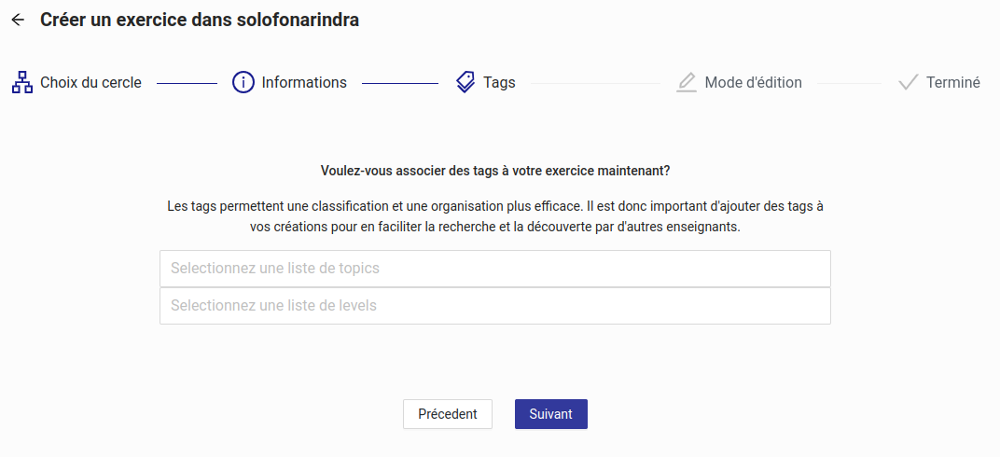
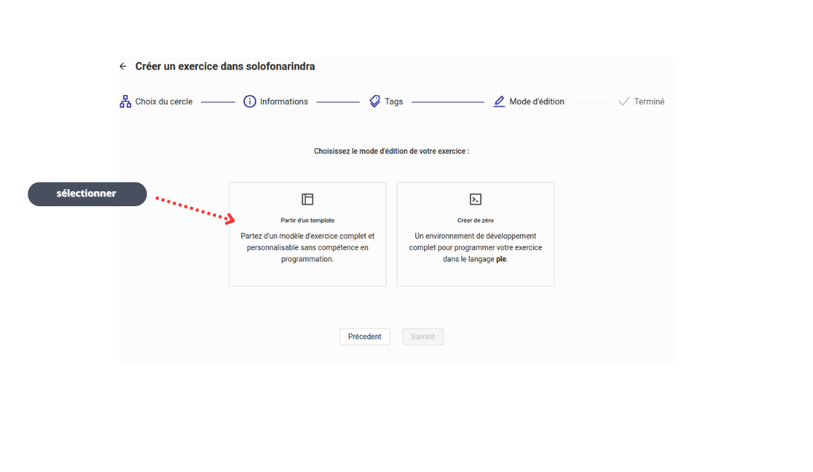
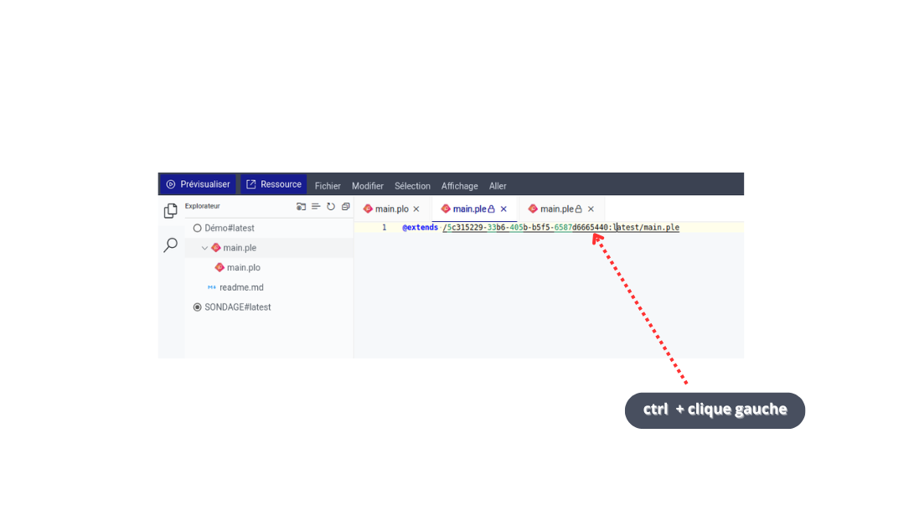

# Guide PLaTon - Création d'exercices

## Étape 1 : Informations de base

### Nom et Description de l'exercice

- **Nom** : Saisissez le nom de votre exercice (ex: "Démo")
- **Description** : Rédigez une description claire de l'exercice (ex: "Faire un simulation pour notre doc")

⚠️ **Important** : Les champs marqués d'un astérisque (*) sont obligatoires et doivent être remplis.

**Navigation** : Utilisez le bouton "Suivant" pour passer à l'étape suivante.

---

## Étape 2 : Attribution des tags

### Pourquoi utiliser des tags ?
Les tags permettent une classification et une organisation plus efficace de vos exercices. Ils facilitent :
- La recherche d'exercices
- La découverte par d'autres enseignants
- L'organisation de votre contenu

### Configuration des tags
- **Sélectionnez une liste de topics** : Choisissez les sujets correspondant à votre exercice
- **Sélectionnez une liste de levels** : Définissez le niveau de difficulté approprié

**Navigation** : Cliquez sur "Suivant" une fois vos tags sélectionnés.

---

## Étape 3 : Mode d'édition

### Choix du mode de création
Vous avez deux options pour créer votre exercice :

#### 📋 "Partir d'un template"
- **Avantage** : Modèle d'exercice complet et personnalisable
- **Utilisation** : Aucune compétence en programmation requise
- **Recommandé pour** : Les débutants ou création rapide

#### 🔧 "Créer de zéro"
- **Avantage** : Environnement de développement complet
- **Utilisation** : Programmation dans le langage ple
- **Recommandé pour** : Les utilisateurs avancés

**Sélection** : Sélectionner sous votre choix préféré.

---

## Étape 4 : Sélection de template

### Catalogue des templates disponibles
Une fois le mode "template" sélectionné, vous accédez à une bibliothèque de modèles :

#### Types de templates populaires :
- **Question ouverte** : Pour les réponses textuelles libres
- **Match list Programmable** : Exercices d'association avec script Python
- **BubbleParametrable** : Listes de paires personnalisables
- **Belle marquise template** : Modèle avec notation (77% pour 22 utilisations)
- **Drag and Drop from list of pairs** : Glisser-déposer depuis une liste
- **Bubble Template Informatique programmable** : Template spécialisé informatique
- **Question de sondage** : Pour collecter des opinions
- **SONDAGE** : Template de sondage simple
- **CheckBox** : Questions à choix multiples

### Informations template :
Chaque template affiche :
- **Statut** : Visualisé/Non visualisé
- **Références** : Nombre d'utilisations
- **Date** : Dernière modification

**Action** : Cliquez sur "Ouvrir la ressource" pour sélectionner un template.

---

## Étape 5 : Environnement de développement

### Interface de programmation
Une fois votre template sélectionné, vous accédez à l'éditeur PLaTon :

### Raccourci utile :
**Ctrl + clic gauche** : Accès vers le code `main.ple` du template de base

#### Structure de fichiers :
- **📁 DémoFlatest** : Dossier principal du projet
  - **📄 main.ple** : Fichier principal de l'exercice
  - **📄 main.plo** : Fichier de configuration
  - **📄 readme.md** : Documentation
- **📁 SONDAGEFlatest** : Autre projet exemple

#### Fonctionnalités de l'éditeur :
- **Onglets multiples** : Travaillez sur plusieurs fichiers simultanément
- **Prévisualisation** : Testez votre exercice en temps réel
- **Ressource** : Accédez aux outils et documentation

---

## Conseils d'utilisation

### Pour les débutants :
1. Commencez par un template simple
2. Modifiez progressivement le contenu
3. Utilisez la prévisualisation régulièrement

### Pour les utilisateurs avancés :
1. Explorez les templates complexes
2. Personnalisez le code selon vos besoins
3. Utilisez les fonctionnalités de debugging

### Bonnes pratiques :
- Remplissez tous les champs obligatoires
- Utilisez des tags pertinents pour faciliter la recherche
- Testez votre exercice avant publication
- Documentez votre travail dans le readme.md

---

*Ce guide vous accompagne dans la création d'exercices sur la plateforme PLaTon. Pour plus d'informations, consultez la documentation complète de la plateforme.*