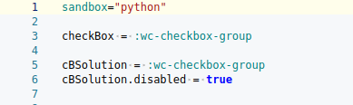
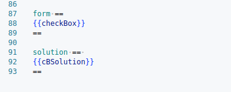

# Checkbox (cases à cocher)

## 🎯 Objectif de l'exercice

  Cet exercice propose à l'apprenant de sélectionner la **bonne réponse** parmi plusieurs propositions affichées sous forme de cases à cocher (CheckBox). Une seule réponse est correcte.

    L'exercice est dynamique : à chaque tentative, une ligne différente est tirée aléatoirement d’un fichier de données, et les choix sont mélangés.

## 🛠️ Fonctionnement technique

### 1) Configuration initiale

* **checkbox :** Composant principal interactif de l'élève
* **cBSolution:** affichage de la solution (non interactif)
* **horizental:** affichage horizental si **True**

### 2) Message Feedback


>  Ces messages sont utilisés dans le **grader** pour informer l'utilisateur du résultat de sa sélection

### 3) Builder (Génération de contenu)

```python
   builder ==#! lang=python
```
* Tire une ligne aléatoire depuis **fichier**.
* Sépare la ligne en **titre** et **éléments**.
* Mélange les choix (**suffle**) pour éviter les biais.
* Formate les composants **checkBox** et **cBSolution**.

    Exemple de ligne dans le fichier

    ```python
    India:Mumbai|Mumbai,Bangalore|Bangalore,Chennai|Chennai,New Delhi|New Delhi/
    Madagascar: Ihosy|Ihosy, Fianarantsoa|Fianarantsoa,Diego|Diego,Antananarivo|Antananarivo/
    ```
* **Titre:**  "Madagascar"
* **sol:** "Antananarivo"
    > Pour chaque ligne de données, la dernière colonne contient la bonne réponse
* Les autres choix sont des dictracteurs
    > **cBSolution** permet d'afficher les bonnes et mauvaises réponses en couleur lors de la correction

### 4) Formulaire et solution



Affiche dynamiquement :
* Le formulaire d'interaction.
* La solution correcte une fois l'exercice corrigé **(solution)**

### 5) Grader (correction)
```python
    grader ==#! lang=python
```
* Parcourt les éléments sélectionnés **(checked)**
* Si la réponse est correcte : grade = 100 et feedback **"Bravo"**
* Sinon : grade = 0 , mise en forme CSS pour indiquer la bonne réponse

## 📁 Fichier de données attendu

Chaque ligne doit être au format suivant :

```makefile
    Question:Choix_i | prononciation_choix_i,Bonne réponse | prononciation/
```
> i allant de 1 à 4
  Tous les éléments sont affichés mélangés à l'utilisateur.


# Résumé des fonctionnalités
|    Élément   |     Rôle  |
|:------|:------|
| `Checkbox`  |    Interface de sélection pour l'élève |
| `cBSolution`| Affiche la solution avec styles CSS (`success-border`)|
|  `builder` | Génére les choix aléatoires et extrait la réponse correcte|
|`grader`| Corrige la réponse et applique les styles selon le résultat|
|`form/solution`| Formate les composants à afficher dans Platon|
