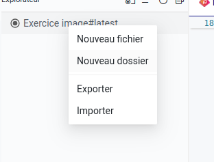
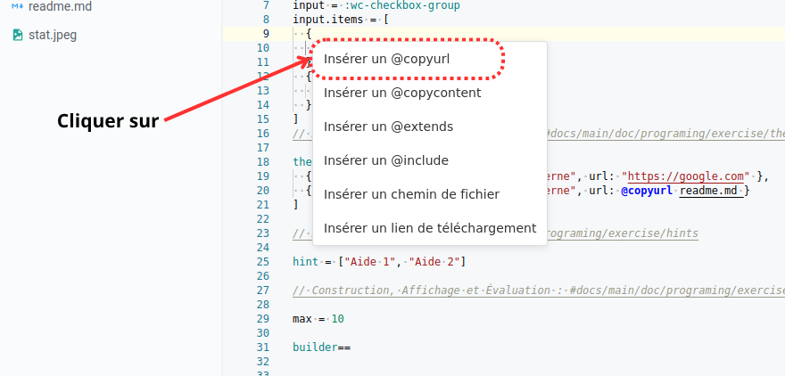
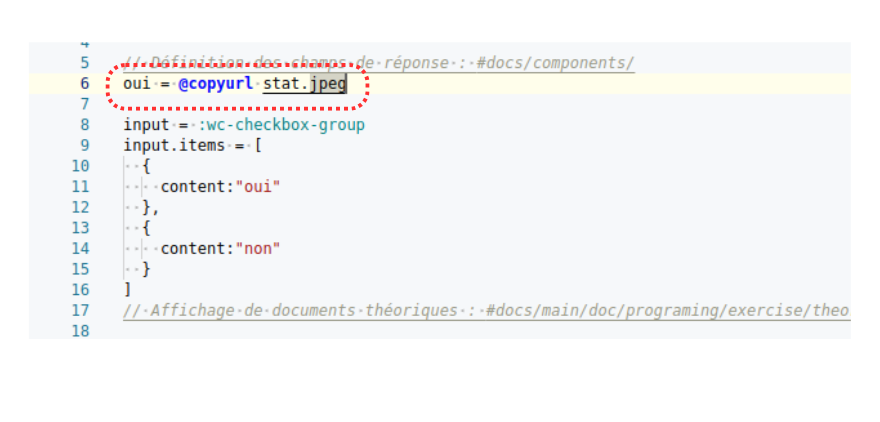
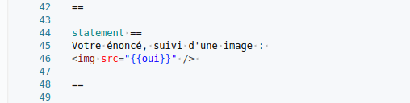

# Importation d’image

Certains exercices intègrent une image explicative pertinente afin de faciliter la compréhension de l’énoncé par les étudiants.
Avec Platon, l’intégration d’images dans un exercice est simple et rapide.

### Utilisation d’images dans un exercice Platon

---
### Tutoriel vidéo

<video
  width="560"
  height="315"
  controls
  preload="auto"
>
  <source src="../../../../docs/screens/tutos/tuto_importation_image.mp4" />
  Votre navigateur ne supporte pas la lecture de vidéos.
</video>

---

##### Où faut-il placer l’image à importer ?

L’image à importer doit être placée dans le **même répertoire** que les fichiers **readme.md** et **main.ple**.
Effectuez un clic droit sur le dossier parent, puis sélectionnez **Importer**.



---

##### Modification du fichier `main.ple`

Glissez-déposez l’image depuis le répertoire, puis sélectionnez **Insérer un `@copyurl`**.



---

Avant d’insérer l’image dans l’énoncé, il est nécessaire d’ajouter son lien dans la section des variables de l’exercice, en l’associant à une variable.
Cette variable servira ensuite de référence dans le corps de l’énoncé.



---

Puisque l’image est utilisée dans l’énoncé, il convient d’insérer la balise HTML `` dans la section `statement`, en précisant l’attribut `src` de la manière suivante :

```html

```



---
