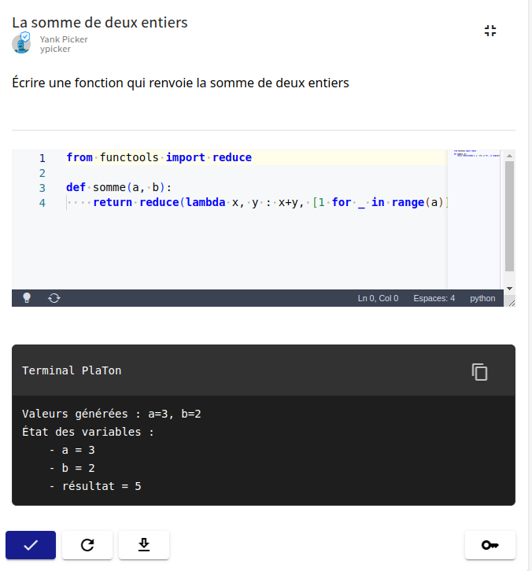

# Débogage d'exercice : logger

### La Fonction `platon_log`

La fonction `platon_log` permet d'afficher des messages typés dans un terminal dédié pendant la prévisualisation d'un exercice. Elle peut être utilisée dans le builder et le grader.

#### Syntaxe

```pl-py
platon_log(message, level=LogType.INFO)
```

Le paramètre `level` est optionnel et accepte l'une des valeurs suivantes :

| Valeur | Utilisation |
|---|---|
| `LogType.INFO` | Message informatif standard *(défaut)* |
| `LogType.WARNING` | Avertissement non bloquant |
| `LogType.ERROR` | Erreur rencontrée dans le script |
| `LogType.DEBUG` | Information de débogage détaillée |

#### Exemples

```pl-py
builder==#!lang=python
import random
from PlatonLogger import LogType


a = random.randint(1, 10)
b = random.randint(1, 10)

platon_log(f"Valeurs générées : a={a}, b={b}")

resultat = a + b
platon_log(f"""État des variables :
- a = {a}
- b = {b}
- résultat = {resultat}""")

if resultat > 15:
    platon_log("La somme dépasse 15, vérifiez les bornes.", level=LogType.WARNING)

platon_log(f"Type de 'resultat' : {type(resultat)}", level="debug")
==
```

Chaque message apparaît dans le terminal avec son type associé, ce qui facilite le filtrage visuel lors du débogage.

> **Note :** Les exceptions non attrapées sont automatiquement capturées et loggées avec `LogType.ERROR`, en indiquant le numéro de ligne dans votre script.

