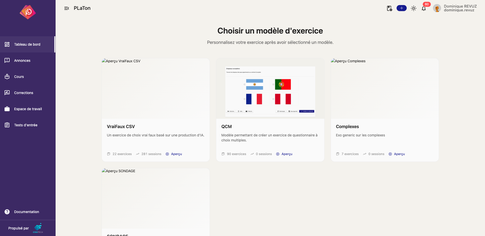
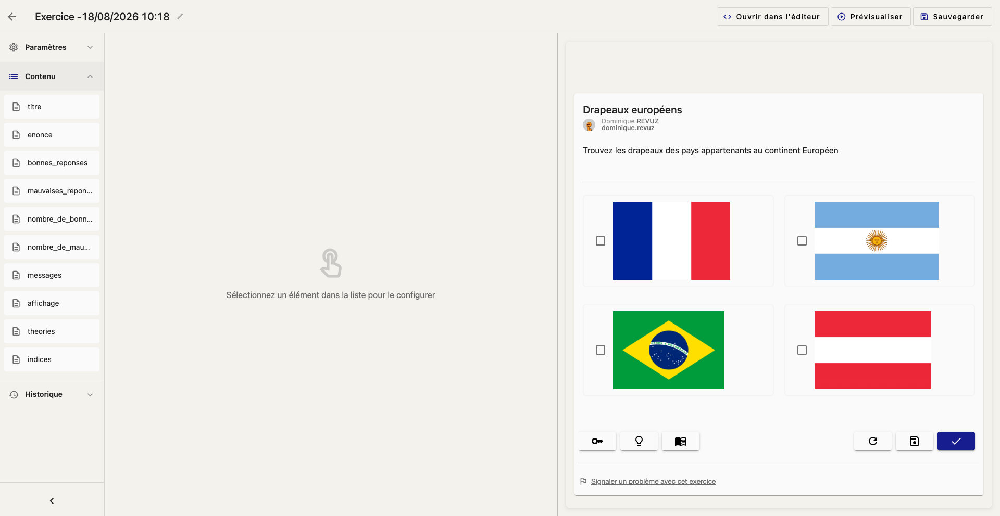
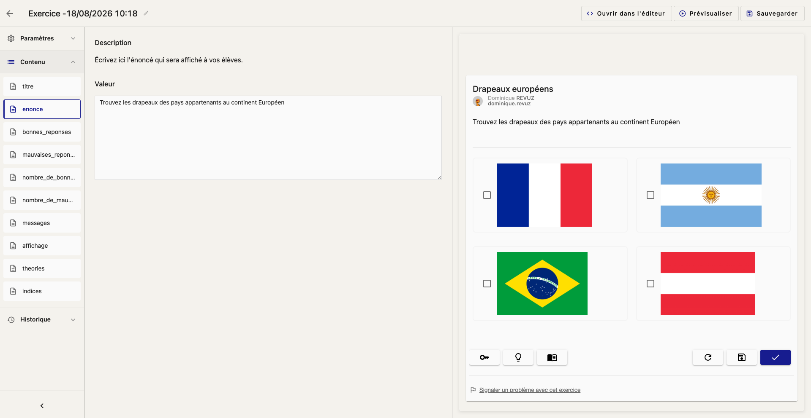
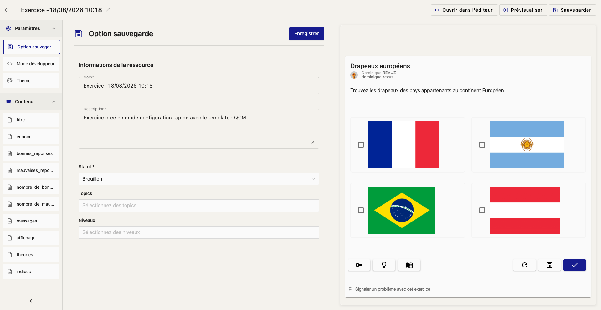
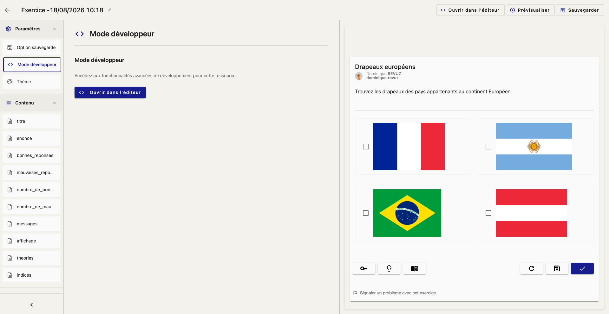
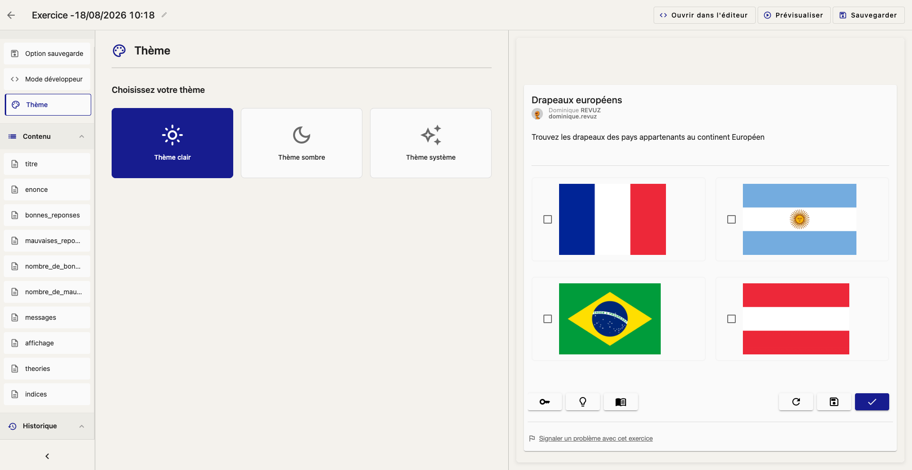
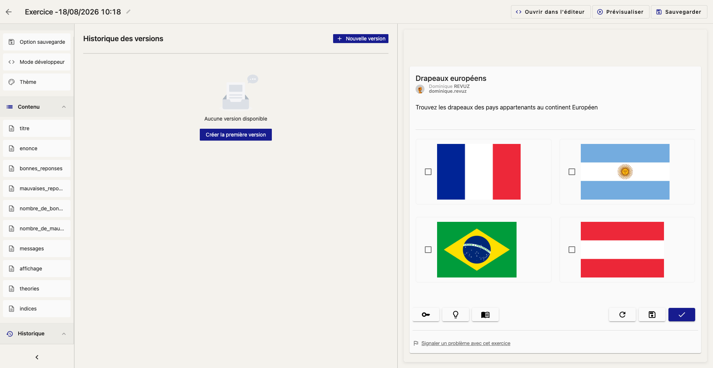
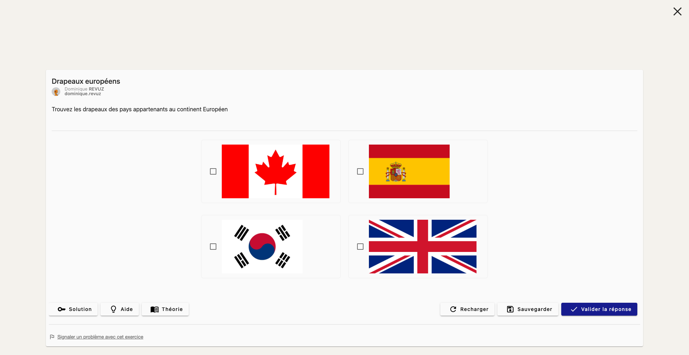

import { Callout } from 'nextra/components'

# Le builder d'exercice

Lorsqu'un exercice est créé à partir d'un [template](/main/programing/exercise/config), ses variables peuvent être personnalisées sans écrire de code grâce au **builder**. Il affiche un formulaire correspondant aux variables exposées par le template, ainsi qu'une prévisualisation de l'exercice mise à jour en temps réel.

## Accéder au builder

Deux chemins mènent au builder :

- Depuis le tableau de bord, dans la section "Choisir un modèle d'exercice", cliquez sur un template pour créer directement un nouvel exercice et ouvrir son builder.

- Depuis un exercice existant basé sur un template, ouvrez son "Mode développeur" ou ses paramètres pour revenir au builder et modifier les variables déjà personnalisées.

<Callout type="info">
  Vous souhaitez créer un template d'exercice ? Rendez-vous dans la documentation sur [la création de templates
  d'exercice](/main/programing/exercise/config).
</Callout>

## Aperçu de l'interface

L'interface est organisée en trois zones :

- **Barre latérale** (gauche) : liste les variables du template sous la section "Contenu", ainsi que les sections "Paramètres" et "Historique".
- **Panneau d'édition** (centre) : affiche le formulaire d'édition de l'élément sélectionné dans la barre latérale.
- **Prévisualisation** (droite) : rejoue l'exercice avec les valeurs actuelles, mise à jour automatiquement après chaque modification.

## Modifier une variable

Cliquez sur une variable dans la section "Contenu" pour afficher son champ d'édition. Sa description (définie par l'auteur du template) rappelle son usage, et la prévisualisation à droite se met à jour après un court délai.

Le titre de l'exercice, affiché en haut de la page, peut également être modifié directement en cliquant sur l'icône crayon à côté.

## Paramètres

La section "Paramètres" de la barre latérale regroupe trois panneaux :

### Option sauvegarde

Modifie les métadonnées de la ressource : nom, description, statut (brouillon, publié, etc.), topics et niveaux.

### Mode développeur

Donne accès au code source de l'exercice via le bouton "Ouvrir dans l'éditeur", pour les personnalisations qui dépassent ce que permet le formulaire du builder.

<Callout type="warning">
  Modifier le code directement dans l'éditeur peut rendre certaines variables incompatibles avec le formulaire du
  builder. Utilisez cette option uniquement si vous êtes à l'aise avec la syntaxe des templates PLaTon.
</Callout>

### Thème

Choisit le thème d'affichage (clair, sombre ou système) utilisé pour la prévisualisation.

## Historique des versions

La section "Historique" liste les versions enregistrées de l'exercice. Vous pouvez créer une nouvelle version pour figer l'état courant, ou restaurer une version antérieure : les variables du builder sont alors rechargées avec les valeurs de cette version.

## Actions du builder

En haut de la page, trois actions sont disponibles quel que soit le panneau affiché :

- **Ouvrir dans l'éditeur** : bascule vers l'éditeur de code pour ce fichier.
- **Prévisualiser** : ouvre la prévisualisation en plein écran.
- **Sauvegarder** : enregistre les valeurs personnalisées (raccourci `Ctrl+S` / `Cmd+S`).

<Callout type="info">
  Tant qu'un exercice créé depuis le tableau de bord n'a pas été sauvegardé, il reste un brouillon nommé
  automatiquement. Si vous quittez le builder sans y apporter de modification, ce brouillon est supprimé.
</Callout>
